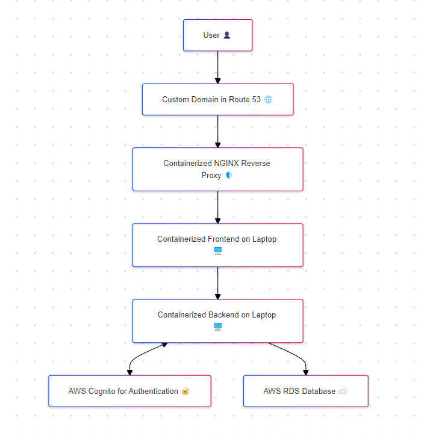
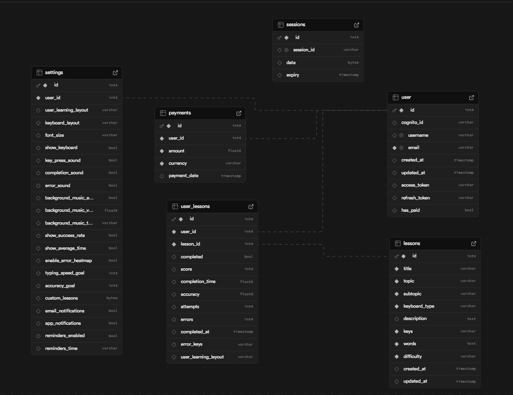

# Alt_keyboard_styles
This is repository for Learn colemak (name not finalized) web app that uses react as frontend and flask as backend with sql db database. It uses cognito as authentication service.

## Alt Style offered

- Dvorak Simplified Keyboard

    - Designed to increase typing speed and reduce finger movement compared to QWERTY.
    - There are two main variants: one for two hands and another for the left or right hand only.
- Colemak

    - A popular alternative that aims to improve upon both QWERTY and Dvorak.
    - Keeps many of the common shortcuts (like Ctrl+C for copy) in the same place as QWERTY.

- Workman

    - Designed with a focus on finger travel distance and ergonomic finger movements.
    - Similar to Colemak but with some keys in different positions to reduce strain.
- Colemak-DH

    - A variant of Colemak that further optimizes key placement to reduce finger movement and increase comfort.
    - It modifies the positions of some keys, such as D and H, to better align with natural finger movement and reduce strain on the home row.

## Application Design of hybrid Deployment

## Database Design:

Refrenced:
https://github.com/gautamop01/KeyboardConqueror-React-Typing-Practice.git

https://itnext.io/how-to-serve-your-backends-with-nginx-a-comprehensive-guide-c8a74955c6ed

Frontend 
- use https://www.creative-tim.com/product/argon-design-system-react as react template

- use https://coolors.co/  & http://colormind.io/ to get more colors

- use https://mycolor.space/  & https://colors.muz.li/ to get color pallets

- Use https://huemint.com/ to test
