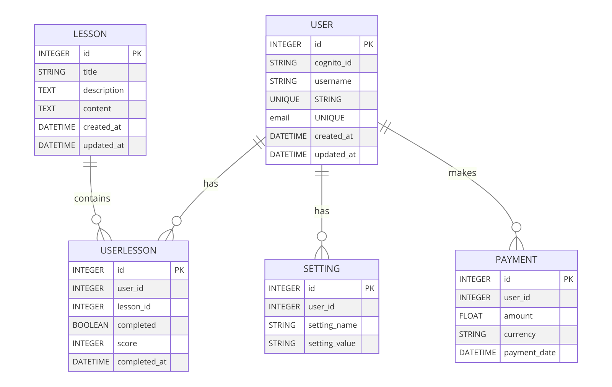

# Learn_Colemak
This is repository for Learn colemak (name not finalized) web app that uses react as frontend and flask as backend with sql db database. It uses cognito as authentication service 

Database Design:

Refrenced:
https://github.com/gautamop01/KeyboardConqueror-React-Typing-Practice.git

## Schedule
Week 1 (May 4 - May 10):

- [x] May 4: Finalize Cognito authentication setup and test integration.
1. Backend Feature Development:
- [ ] May 5-6: Implement core features:
2. Develop APIs for practice modes and user progress tracking.
- [ ] May 7-8: Set up Stripe for payment processing in the backend:
- [ ] Implement payment flow and integrate Stripe.
- [ ] May 9-10: Implement advanced features:
Leaderboards, typing challenges, and user profiles APIs.
Week 2 (May 11 - May 17):
3. Frontend Development:

- [ ] May 11: Set up the React project and establish the folder structure.
- [ ] May 12-13: Implement user authentication UI and integrate with AWS Cognito.
- [ ] May 14-15: Integrate the keyboard layout SVG provided by the designer.
- [ ] May 16-17: Develop core features:
Practice modes and user progress tracking UI.
- [ ] Week 3 (May 18 - May 24):
4. Frontend Feature Implementation:

- [ ] May 18-19: Implement advanced frontend features:
Leaderboards, typing challenges, and user profiles.
- [ ] May 20-21: Develop interactive keyboard lighting feature.
- [ ] May 22-23: Ensure UI consistency and responsiveness.
Week 4 (May 25 - May 31):
5. Testing & Deployment:

- [ ] May 25-26: Conduct thorough testing, both manual and automated.
- [ ] May 27-28: Fix bugs and optimize the application.
- [ ] May 29-31: Finalize and deploy the application.

Frontend 
- use https://www.creative-tim.com/product/argon-design-system-react as react template