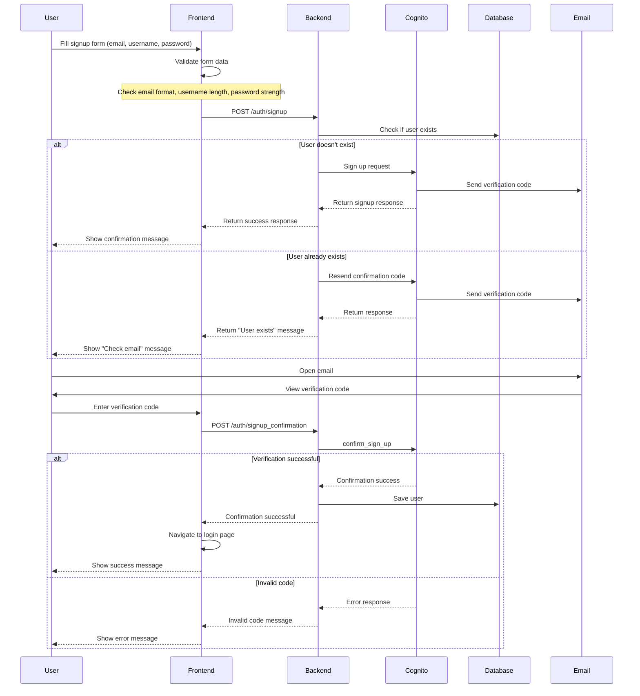

# User Signup Flow Diagram

## Signup Request Flow

## Technical Details

1. **Frontend Validation**
   - Email using regex pattern `/\S+@\S+\.\S+/`
   - Username minimum length: 3 characters
   - Password requirements: 8+ characters with uppercase, lowercase, and number

2. **Backend Processing**
   - Checks both email and username for duplicates
   - Uses AWS Cognito for user authentication
   - Secret hash generation for Cognito API calls

3. **Database Integration**
   - User info stored after successful verification
   - Stores username, email for future reference
   - Does not store raw passwords (handled by Cognito)

4. **Error Handling**
   - 409: User already exists
   - 400: Invalid data provided
   - 429: Rate limiting (too many requests)

## Dependencies

- Frontend: React, axios, js-cookie
- Backend: Flask, boto3, Cognito integration
- Database: PostgreSQL (via SQLAlchemy)
- Authentication: AWS Cognito
